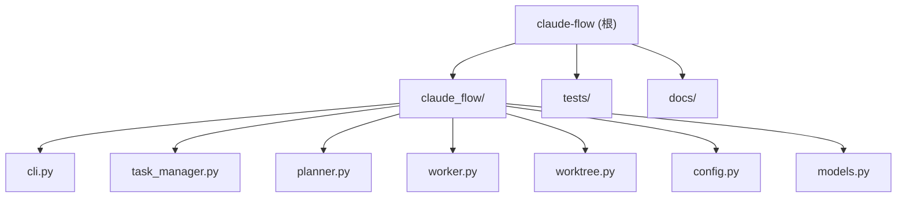

# Claude Flow

## 项目愿景

Claude Flow 是一个多实例 Claude Code 工作流管理器。它允许开发者在任意 Git 项目中管理多个 Claude Code 实例并行开发，通过任务队列、Git Worktree 隔离和 Plan Mode 审批流程实现高效的 AI 辅助开发工作流。

## 技术栈

| 类别 | 技术 |
|------|------|
| 语言 | Python 3.10+ |
| CLI 框架 | Click >= 8.0 |
| 并发模型 | subprocess + multiprocessing（多进程 Worker） |
| 文件锁 | fcntl.flock（仅 Linux/macOS） |
| 版本隔离 | Git Worktree |
| 数据存储 | JSON 文件（tasks.json, config.json） |
| 测试 | pytest >= 7.0, pytest-cov |
| 打包 | setuptools + pyproject.toml |

## 架构总览

项目采用单包模块化架构，核心组件之间通过明确的职责分离协作：

- **CLI 层** (`cli.py`) -- Click 命令入口，解析用户输入并调度各管理器
- **任务管理层** (`task_manager.py`) -- 任务 CRUD、文件锁保护的并发安全队列
- **对话层** (`chat.py`) -- ChatSession 模型和 ChatManager，支持多轮交互式计划创建
- **计划层** (`planner.py`) -- 封装 Claude Code 的 plan mode，自动/交互式生成计划文档
- **执行层** (`worker.py`) -- Worker 生命周期管理，在 worktree 中运行 Claude Code
- **基础设施层** (`worktree.py`, `config.py`, `models.py`) -- Git worktree 操作、配置加载、数据模型

### 任务生命周期

```
pending --> 选择模式:
  ├─ auto:        planning --> planned
  └─ interactive: planning <-> (多轮聊天) --> finalize --> planned
                                    ↓
              planned --> (人工 review) --> approved --> running --> merging --> done
                                                                          \-> failed
```

## 模块结构图



## 模块索引

| 模块路径 | 职责 | 入口文件 | 测试覆盖 |
|----------|------|----------|----------|
| `claude_flow/` | 核心包 -- CLI、任务管理、Worker、Worktree、Planner | `cli.py` (CLI 入口 `cf`) | 7 个测试文件，覆盖全部模块 |
| `tests/` | 单元测试套件 | `conftest.py` (共享 fixture) | -- |
| `docs/` | 项目文档与设计方案 | -- | -- |

## 运行与开发

### 安装

```bash
# 生产安装
pip install -e .

# 开发安装（含测试依赖）
pip install -e ".[dev]"
```

### CLI 入口

安装后可通过 `cf` 命令使用：

```bash
cf init                              # 初始化 .claude-flow/ 目录
cf task add -p "prompt" "标题"        # 添加任务
cf task list                         # 查看任务列表
cf plan                              # 自动生成所有 pending 任务的计划
cf plan -t <task_id>                 # 自动生成指定任务的计划
cf plan -t <task_id> --interactive   # 启动交互式聊天规划
cf plan chat <task_id>               # 与 AI 交互式对话（REPL 模式）
cf plan chat <task_id> -m "msg"      # 发送单条聊天消息
cf plan finalize <task_id>           # 从聊天生成计划文档
cf plan review                       # 交互式审批
cf plan approve <task_id> [--all]    # 批准计划
cf plan status                       # 查看计划进度
cf run [-n N]                        # 启动 Worker 执行
cf status                            # 查看状态总览
cf log <task_id>                     # 查看执行日志
cf clean                             # 清理 worktree
cf reset <task_id>                   # 重置失败任务
cf retry                             # 重试所有失败任务
```

### 环境变量

| 变量名 | 用途 |
|--------|------|
| `CF_PROJECT_ROOT` | 覆盖自动检测的项目根目录 |
| `EDITOR` | `cf plan review` 编辑模式使用的编辑器（默认 `vi`） |

### 前置要求

- Python 3.10+
- Git（需支持 worktree）
- Claude Code CLI（`claude` 命令可用且已配置 API key）
- Linux 或 macOS（文件锁依赖 `fcntl`）

## 测试策略

- 框架：pytest
- 测试目录：`tests/`
- 共享 fixture：`tests/conftest.py`（提供临时 git 仓库 `git_repo`）
- 外部依赖 mock：Claude Code 和 Git 子进程调用通过 `unittest.mock.patch` 隔离
- 运行测试：`pytest -v`

### 测试文件对应关系

| 测试文件 | 被测模块 |
|----------|----------|
| `test_models.py` | `models.py` |
| `test_config.py` | `config.py` |
| `test_task_manager.py` | `task_manager.py` |
| `test_planner.py` | `planner.py` |
| `test_worktree.py` | `worktree.py` |
| `test_worker.py` | `worker.py` |
| `test_cli.py` | `cli.py` |

## 编码规范

- 使用 Python dataclass 定义数据模型
- 使用 `from __future__ import annotations` 支持延迟类型注解
- 枚举类型用 `Enum` 定义状态常量
- 所有文件操作使用 `pathlib.Path`
- 并发安全通过 `fcntl.flock` 文件锁实现
- 外部进程调用统一使用 `subprocess.run`
- CLI 使用 Click 装饰器模式

## AI 使用指引

- 本项目的 CLI 入口是 `claude_flow/cli.py` 中的 `main` 函数
- 任务数据存储在目标项目的 `.claude-flow/tasks.json` 中（非本项目目录）
- Worker 通过 `subprocess` 调用 `claude` CLI，不直接使用 API
- 修改任务管理逻辑时注意文件锁的正确释放
- 添加新 CLI 命令时遵循 Click group/command 嵌套模式
- 测试中需要 git 仓库的用例使用 `git_repo` fixture

## 变更记录 (Changelog)

| 时间 | 操作 |
|------|------|
| 2026-03-05T14:07:01 | 初始化项目文档（init-architect 自适应扫描） |


## Worktree 工作目录约束（自动生成）

你当前工作在一个 Git Worktree 隔离环境中：
- **工作目录**：`/opt/shared/claude-flow/.claude-flow/worktrees/task-e370d3`
- **任务 ID**：`task-e370d3`
- **主仓库**：`/opt/shared/claude-flow`（禁止直接修改）

**强制规则**：
1. 所有文件读写操作必须限定在 `/opt/shared/claude-flow/.claude-flow/worktrees/task-e370d3` 目录内
2. 禁止使用 `/opt/shared/claude-flow` 的绝对路径操作文件
3. 使用相对路径或以 `/opt/shared/claude-flow/.claude-flow/worktrees/task-e370d3` 为前缀的绝对路径
