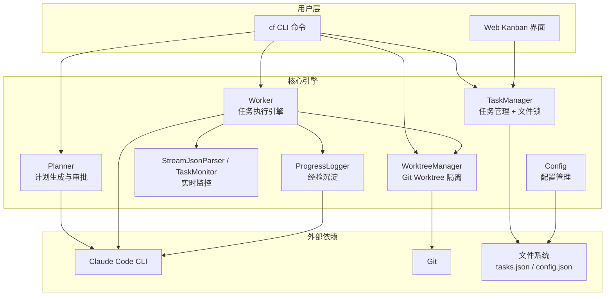
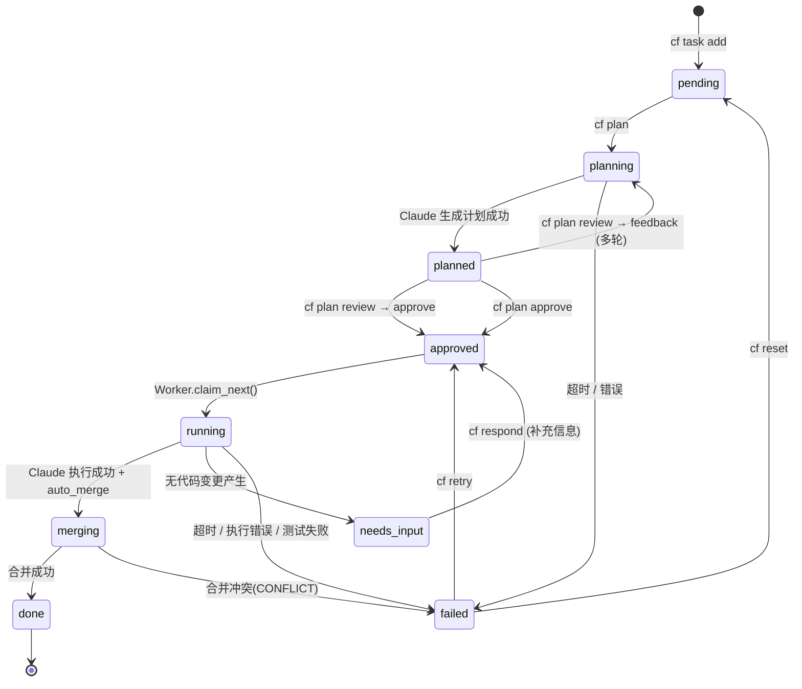
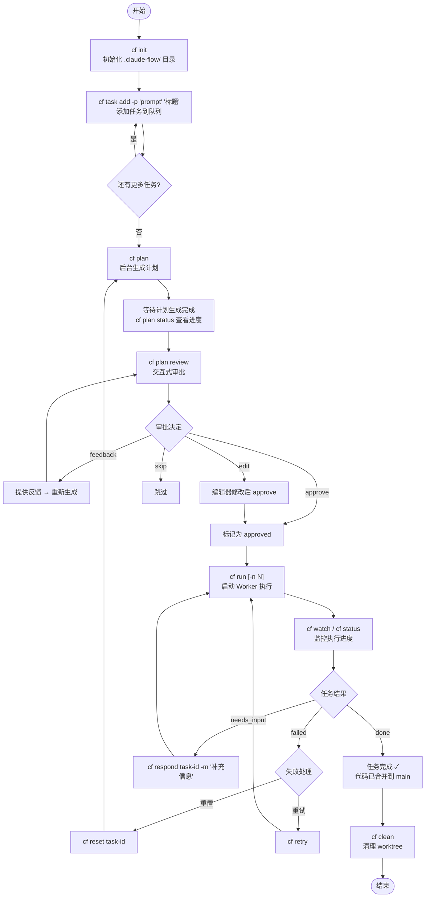
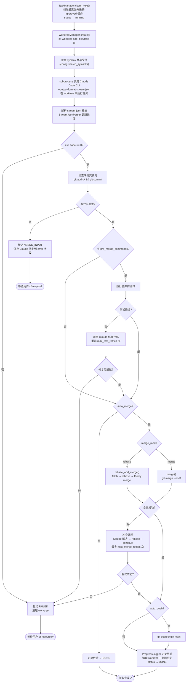
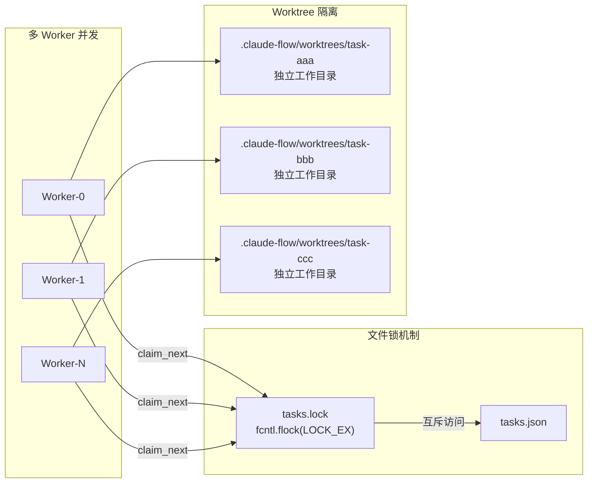
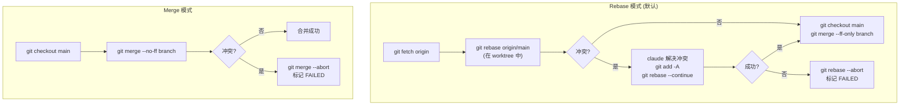
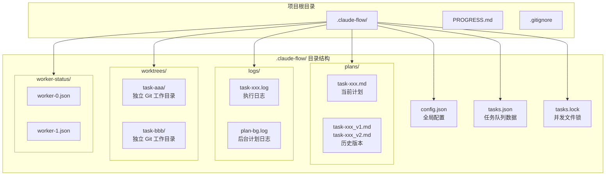
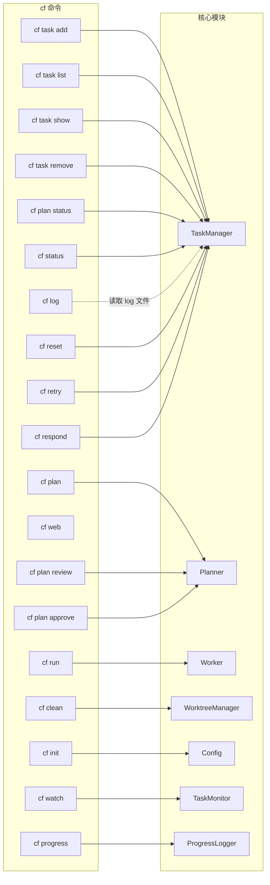

# Claude Flow 全流程图

## 1. 系统架构总览

```mermaid
graph TB
    subgraph User["用户层"]
        CLI["cf CLI 命令"]
        WEB["Web Kanban 界面"]
    end

    subgraph Core["核心引擎"]
        TM["TaskManager<br/>任务管理 + 文件锁"]
        PL["Planner<br/>计划生成与审批"]
        WK["Worker<br/>任务执行引擎"]
        WT["WorktreeManager<br/>Git Worktree 隔离"]
        MO["StreamJsonParser / TaskMonitor<br/>实时监控"]
        PG["ProgressLogger<br/>经验沉淀"]
        CF["Config<br/>配置管理"]
    end

    subgraph External["外部依赖"]
        CLAUDE["Claude Code CLI"]
        GIT["Git"]
        FS["文件系统<br/>tasks.json / config.json"]
    end

    CLI --> TM
    CLI --> PL
    CLI --> WK
    CLI --> WT
    WEB --> TM

    TM --> FS
    PL --> CLAUDE
    WK --> CLAUDE
    WK --> WT
    WK --> MO
    WK --> PG
    WT --> GIT
    PG --> CLAUDE
    CF --> FS
```

## 2. 任务完整生命周期

```mermaid
stateDiagram-v2
    [*] --> pending : cf task add

    pending --> planning : cf plan
    planning --> planned : Claude 生成计划成功
    planning --> failed : 超时 / 错误

    planned --> approved : cf plan review → approve
    planned --> planning : cf plan review → feedback (多轮)
    planned --> approved : cf plan approve

    approved --> running : Worker.claim_next()
    running --> merging : Claude 执行成功 + auto_merge
    running --> needs_input : 无代码变更产生
    running --> failed : 超时 / 执行错误 / 测试失败

    merging --> done : 合并成功
    merging --> failed : 合并冲突(CONFLICT)

    needs_input --> approved : cf respond (补充信息)
    failed --> pending : cf reset
    failed --> approved : cf retry

    done --> [*]
```

## 3. 用户操作流程（端到端）

```mermaid
flowchart TD
    START(["开始"]) --> INIT["cf init<br/>初始化 .claude-flow/ 目录"]
    INIT --> ADD["cf task add -p 'prompt' '标题'<br/>添加任务到队列"]
    ADD --> MORE{还有更多任务?}
    MORE -->|是| ADD
    MORE -->|否| PLAN["cf plan<br/>后台生成计划"]

    PLAN --> WAIT["等待计划生成完成<br/>cf plan status 查看进度"]
    WAIT --> REVIEW["cf plan review<br/>交互式审批"]

    REVIEW --> DECIDE{审批决定}
    DECIDE -->|approve| APPROVED["标记为 approved"]
    DECIDE -->|feedback| FEEDBACK["提供反馈 → 重新生成"]
    FEEDBACK --> REVIEW
    DECIDE -->|edit| EDIT["编辑器修改后 approve"]
    EDIT --> APPROVED
    DECIDE -->|skip| SKIP["跳过"]

    APPROVED --> RUN["cf run [-n N]<br/>启动 Worker 执行"]
    RUN --> MONITOR["cf watch / cf status<br/>监控执行进度"]

    MONITOR --> CHECK{任务结果}
    CHECK -->|done| SUCCESS["任务完成 ✓<br/>代码已合并到 main"]
    CHECK -->|needs_input| RESPOND["cf respond task-id -m '补充信息'"]
    RESPOND --> RUN
    CHECK -->|failed| FAIL_ACTION{失败处理}
    FAIL_ACTION -->|重置| RESET["cf reset task-id"]
    RESET --> PLAN
    FAIL_ACTION -->|重试| RETRY["cf retry"]
    RETRY --> RUN

    SUCCESS --> CLEAN["cf clean<br/>清理 worktree"]
    CLEAN --> END(["结束"])
```

## 4. Worker 执行流程（单任务）

```mermaid
flowchart TD
    CLAIM["TaskManager.claim_next()<br/>领取最高优先级的 approved 任务<br/>status → running"] --> CREATE_WT["WorktreeManager.create()<br/>git worktree add -b cf/task-id"]

    CREATE_WT --> SYMLINK["设置 symlink 共享文件<br/>(config.shared_symlinks)"]
    SYMLINK --> EXEC["subprocess 调用 Claude Code CLI<br/>--output-format stream-json<br/>在 worktree 中执行任务"]

    EXEC --> PARSE["解析 stream-json 输出<br/>StreamJsonParser 更新进度"]

    PARSE --> EXIT_CHECK{exit code == 0?}
    EXIT_CHECK -->|否| MARK_FAIL["标记 FAILED<br/>清理 worktree"]
    EXIT_CHECK -->|是| AUTO_COMMIT["检查未提交变更<br/>git add -A && git commit"]

    AUTO_COMMIT --> HAS_CHANGES{有代码变更?}
    HAS_CHANGES -->|否| NEEDS_INPUT["标记 NEEDS_INPUT<br/>保存 Claude 回复到 error 字段"]

    HAS_CHANGES -->|是| PRE_MERGE{有 pre_merge_commands?}
    PRE_MERGE -->|否| MERGE_CHECK{auto_merge?}
    PRE_MERGE -->|是| RUN_TESTS["执行合并前测试"]

    RUN_TESTS --> TESTS_PASS{测试通过?}
    TESTS_PASS -->|否| FIX_LOOP["调用 Claude 修复代码<br/>重试 max_test_retries 次"]
    FIX_LOOP --> TESTS_PASS2{修复后通过?}
    TESTS_PASS2 -->|否| MARK_FAIL
    TESTS_PASS2 -->|是| MERGE_CHECK

    TESTS_PASS -->|是| MERGE_CHECK

    MERGE_CHECK -->|否| LOG_DONE["记录经验 → DONE"]
    MERGE_CHECK -->|是| MERGE_MODE{merge_mode}

    MERGE_MODE -->|rebase| REBASE["rebase_and_merge()<br/>fetch → rebase → ff-only merge"]
    MERGE_MODE -->|merge| MERGE["merge()<br/>git merge --no-ff"]

    REBASE --> MERGE_OK{合并成功?}
    MERGE --> MERGE_OK

    MERGE_OK -->|否| CONFLICT["冲突处理<br/>Claude 解决 → rebase --continue<br/>最多 max_merge_retries 次"]
    CONFLICT --> CONFLICT_OK{解决成功?}
    CONFLICT_OK -->|否| MARK_FAIL
    CONFLICT_OK -->|是| PUSH_CHECK

    MERGE_OK -->|是| PUSH_CHECK{auto_push?}
    PUSH_CHECK -->|否| CLEANUP
    PUSH_CHECK -->|是| PUSH["git push origin main"]
    PUSH --> CLEANUP

    CLEANUP["ProgressLogger 记录经验<br/>清理 worktree + 删除分支<br/>status → DONE"]

    NEEDS_INPUT --> DONE_FAIL(["等待用户 cf respond"])
    MARK_FAIL --> DONE_FAIL2(["等待用户 cf reset/retry"])
    LOG_DONE --> DONE_OK(["任务完成 ✓"])
    CLEANUP --> DONE_OK
```

## 5. 计划生成与审批流程

```mermaid
flowchart TD
    subgraph PlanGeneration["计划生成 (cf plan)"]
        START_PLAN(["cf plan"]) --> BG_CHECK{--foreground?}
        BG_CHECK -->|否| BG["后台模式<br/>os.fork() 创建子进程"]
        BG_CHECK -->|是| FG["前台模式（阻塞）"]

        BG --> DETACH["setsid() 脱离终端<br/>重定向 stdio → plan-bg.log"]
        DETACH --> GEN_LOOP

        FG --> GEN_LOOP["遍历 pending 任务"]
        GEN_LOOP --> SET_PLANNING["status → planning"]
        SET_PLANNING --> CALL_CLAUDE["claude -p '计划前缀 + prompt'<br/>--print --output-format text"]
        CALL_CLAUDE --> PLAN_OK{成功?}
        PLAN_OK -->|是| SAVE_PLAN["保存 {task-id}.md<br/>status → planned"]
        PLAN_OK -->|否| PLAN_FAIL["status → failed<br/>记录 error"]
    end

    subgraph PlanReview["计划审批 (cf plan review)"]
        START_REVIEW(["cf plan review"]) --> LIST_PLANNED["列出所有 planned 任务"]
        LIST_PLANNED --> SHOW_PLAN["显示计划内容<br/>（strip ANSI 转义）"]
        SHOW_PLAN --> PROMPT["用户选择:<br/>[a]pprove [f]eedback [s]kip [e]dit [q]uit"]

        PROMPT -->|approve| DO_APPROVE["status → approved"]
        PROMPT -->|feedback| DO_FEEDBACK["用户输入反馈<br/>Planner.generate_interactive()"]
        DO_FEEDBACK --> REGEN["构建 prompt:<br/>原始 prompt + 前版计划 + 用户反馈"]
        REGEN --> SAVE_VERSION["保存 {task-id}_v{n}.md<br/>更新 {task-id}.md<br/>status → planned"]
        SAVE_VERSION --> SHOW_PLAN
        PROMPT -->|edit| DO_EDIT["打开 $EDITOR 编辑<br/>status → approved"]
        PROMPT -->|skip| NEXT["下一个任务"]
        PROMPT -->|quit| EXIT_REVIEW(["退出审批"])
    end
```

## 6. 并发安全模型

```mermaid
flowchart LR
    subgraph Workers["多 Worker 并发"]
        W0["Worker-0"]
        W1["Worker-1"]
        W2["Worker-N"]
    end

    subgraph LockMech["文件锁机制"]
        LOCK["tasks.lock<br/>fcntl.flock(LOCK_EX)"]
        TASKS["tasks.json"]
    end

    subgraph Isolation["Worktree 隔离"]
        WT0[".claude-flow/worktrees/task-aaa<br/>独立工作目录"]
        WT1[".claude-flow/worktrees/task-bbb<br/>独立工作目录"]
        WT2[".claude-flow/worktrees/task-ccc<br/>独立工作目录"]
    end

    W0 -->|claim_next| LOCK
    W1 -->|claim_next| LOCK
    W2 -->|claim_next| LOCK
    LOCK -->|互斥访问| TASKS

    W0 --> WT0
    W1 --> WT1
    W2 --> WT2
```

## 7. 合并策略对比

```mermaid
flowchart TD
    subgraph RebaseMode["Rebase 模式 (默认)"]
        R1["git fetch origin"] --> R2["git rebase origin/main<br/>(在 worktree 中)"]
        R2 --> R3{冲突?}
        R3 -->|否| R4["git checkout main<br/>git merge --ff-only branch"]
        R3 -->|是| R5["claude 解决冲突<br/>git add -A<br/>git rebase --continue"]
        R5 --> R6{成功?}
        R6 -->|是| R4
        R6 -->|否| R7["git rebase --abort<br/>标记 FAILED"]
    end

    subgraph MergeMode["Merge 模式"]
        M1["git checkout main"] --> M2["git merge --no-ff branch"]
        M2 --> M3{冲突?}
        M3 -->|否| M4["合并成功"]
        M3 -->|是| M5["git merge --abort<br/>标记 FAILED"]
    end
```

## 8. 数据存储结构

```mermaid
graph TD
    subgraph ProjectRoot["项目根目录"]
        CF_DIR[".claude-flow/"]
        PROGRESS["PROGRESS.md"]
        GITIGNORE[".gitignore"]
    end

    subgraph CFDir[".claude-flow/ 目录结构"]
        CONFIG["config.json<br/>全局配置"]
        TASKS_JSON["tasks.json<br/>任务队列数据"]
        TASKS_LOCK["tasks.lock<br/>并发文件锁"]

        subgraph Plans["plans/"]
            PLAN_MD["task-xxx.md<br/>当前计划"]
            PLAN_V["task-xxx_v1.md<br/>task-xxx_v2.md<br/>历史版本"]
        end

        subgraph Logs["logs/"]
            TASK_LOG["task-xxx.log<br/>执行日志"]
            BG_LOG["plan-bg.log<br/>后台计划日志"]
        end

        subgraph Worktrees["worktrees/"]
            WT_A["task-aaa/<br/>独立 Git 工作目录"]
            WT_B["task-bbb/<br/>独立 Git 工作目录"]
        end

        subgraph WStatus["worker-status/"]
            WS_0["worker-0.json"]
            WS_1["worker-1.json"]
        end
    end

    CF_DIR --> CONFIG
    CF_DIR --> TASKS_JSON
    CF_DIR --> TASKS_LOCK
    CF_DIR --> Plans
    CF_DIR --> Logs
    CF_DIR --> Worktrees
    CF_DIR --> WStatus
```

## 9. CLI 命令映射

```mermaid
graph LR
    subgraph Commands["cf 命令"]
        INIT["cf init"]
        TASK_ADD["cf task add"]
        TASK_LIST["cf task list"]
        TASK_SHOW["cf task show"]
        TASK_RM["cf task remove"]
        PLAN_CMD["cf plan"]
        PLAN_S["cf plan status"]
        PLAN_R["cf plan review"]
        PLAN_A["cf plan approve"]
        RUN["cf run"]
        WATCH["cf watch"]
        WEB_CMD["cf web"]
        STATUS["cf status"]
        LOG["cf log"]
        CLEAN["cf clean"]
        RESET["cf reset"]
        RETRY["cf retry"]
        RESPOND["cf respond"]
        PROG["cf progress"]
    end

    subgraph Modules["核心模块"]
        TM2["TaskManager"]
        PL2["Planner"]
        WK2["Worker"]
        WT2["WorktreeManager"]
        CF2["Config"]
        MO2["TaskMonitor"]
        PG2["ProgressLogger"]
    end

    INIT --> CF2
    TASK_ADD --> TM2
    TASK_LIST --> TM2
    TASK_SHOW --> TM2
    TASK_RM --> TM2
    PLAN_CMD --> PL2
    PLAN_S --> TM2
    PLAN_R --> PL2
    PLAN_A --> PL2
    RUN --> WK2
    WATCH --> MO2
    STATUS --> TM2
    LOG -.-> |读取 log 文件| TM2
    CLEAN --> WT2
    RESET --> TM2
    RETRY --> TM2
    RESPOND --> TM2
    PROG --> PG2
```
